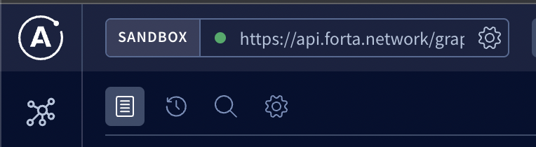

# Query details of a blockchain project

## What information will I get?

This query will return details of a specific blockchain project. The original data source is at [ethereums-lists/contracts github repository](https://github.com/ethereum-lists/contracts#projects-entries).

## How to execute this query?

Step 1: Go to [Forta API Sandbox](https://studio.apollographql.com/sandbox?endpoint=https%3A%2F%2Fapi.forta.network%2Fgraphql). Make sure the endpoint is set to `https://api.forta.network/graphql` in the top left corner before proceeding to the next steps.
<p align="left">
  
</p>

Step 2: Create a new workspace.
<p align="left">
  
</p>

Step 3: Paste the following query in the `Operation` panel. For more details on the available project fields, please checkout the [Project Schema](https://studio.apollographql.com/sandbox/schema/reference/objects/Project).

```graphql
query Project($projectId: String!) {
  project(id: $projectId) {
    name
    id
    token {
      address
      chainId
    }
  }
}
```

<p align="left">
  
</p>

Step 4: Replace the placeholders in the following query parameters and paste them in the `Variable` panel.
```json
{
  "projectId": "<BLOCK_CHAIN_PROJECT_ID>"
}
```

<p align="left">
  
</p>

Step 5: Click on the blue submit button on the `Operation` panel to execute the query.

The button will look like the following:

> NOTE: The button text will be different depending on the query name.

<p align="left">
  
</p>

And that's it! You should be able to see the query results in the `Response` panel on the right.
