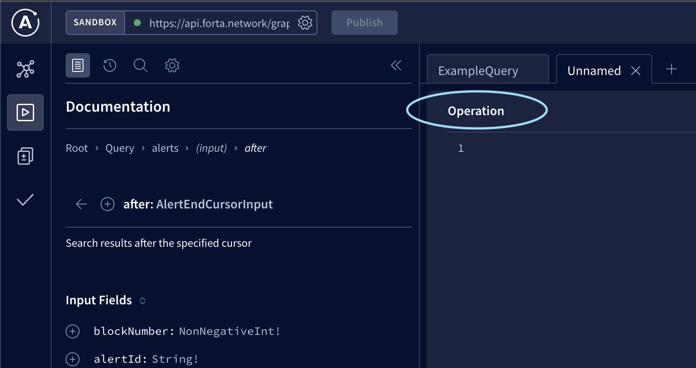

# Query a list of blockchain projects

## What information will I get?

This query will return all existing blockchain projects in alphabetical order. The original data source is at [ethereums-lists/contracts github repository](https://github.com/ethereum-lists/contracts#projects-entries).

## How to execute this query?

Step 1: Go to [Forta API Sandbox](https://studio.apollographql.com/sandbox?endpoint=https%3A%2F%2Fapi.forta.network%2Fgraphql). Make sure the endpoint is set to `https://api.forta.network/graphql` in the top left corner before proceeding to the next steps.
<p align="left">
  
</p>

Step 2: Create a new workspace.
<p align="left">
  
</p>

Step 3: Paste the following query in the `Operation` panel. For more details on the available project fields, please checkout the [ProjectsResponse Schema](https://studio.apollographql.com/sandbox/schema/reference/objects/ProjectsResponse).

```graphql
query Projects($input: ProjectsInput) {
  projects(input: $input) {
    pageInfo {
      hasNextPage
      endCursor
    }
    edges {
      cursor
      node {
        name
        id
      }
    }
  }
}
```

<p align="left">
  
</p>

Step 4: Paste the following query parameters in the `Variable` panel. For more details on the available query parameters, please checkout the [ProjectsInput Schema](https://studio.apollographql.com/sandbox/schema/reference/inputs/AlertsInput)
```json
{
  "input": {
    "first": 10
  }
}
```

<p align="left">
  
</p>

Step 5: Click on the blue submit button on the `Operation` panel to execute the query.

The button will look like the following:

> NOTE: The button text will be different depending on the query name.

<p align="left">
  
</p>

And that's it! You should be able to see the query results in the `Response` panel on the right.

## The results are paginated, how do I get the next page?

If the output returns `"hasNextPage": true`, add the `"endCursor"`value for the `after` query parameter in the `input` object to get the next page of projects and execute the query.

```javascript
{
  "input": {
    ...
    "after": "<END_CURSOR>"
  }
}
```
