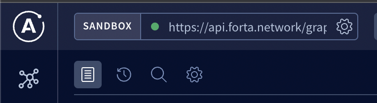
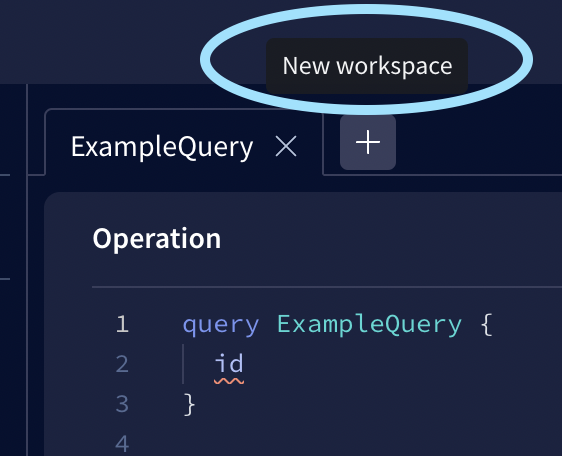
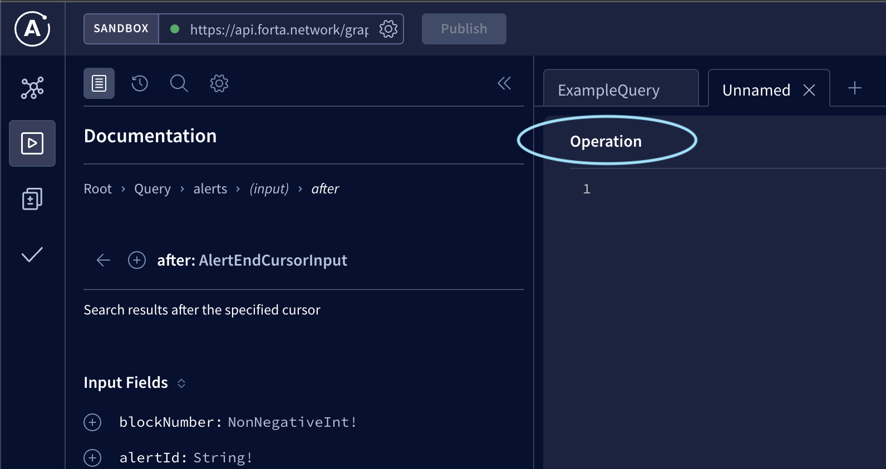
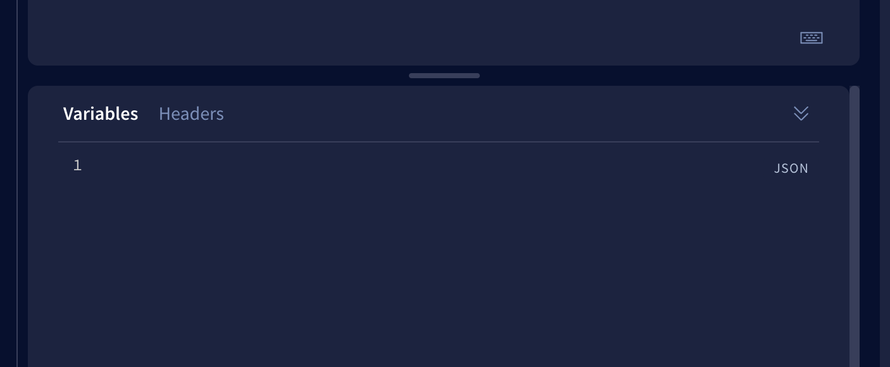
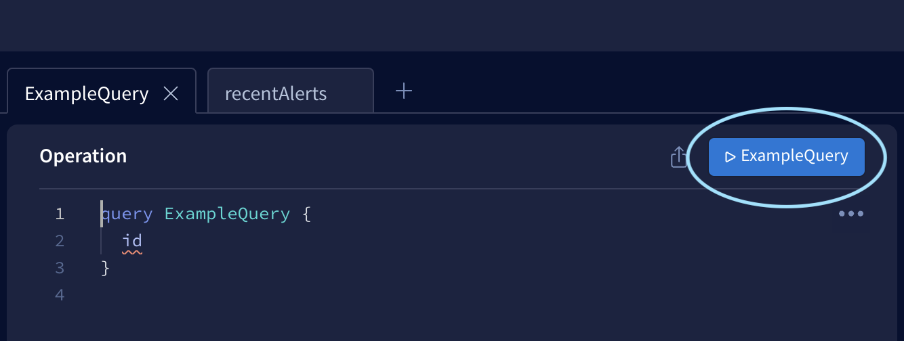

# Query today's alerts associated with certain addressees

## What information will I get?

This query will return today's alerts associated with certain wallets or smart contract addresses. This query can be useful if you'd like to monitor or analyze a specific contract or wallet activity:

Some example use cases:
* Monitor alerts across agents that are associated with suspicious wallets.
* Analyze alerts related to a specific smart contract and summarize common interactions with the contract.

## How to execute this query?

Step 1: Go to [Forta API Sandbox](https://studio.apollographql.com/sandbox?endpoint=https%3A%2F%2Fapi.forta.network%2Fgraphql). Make sure the endpoint is set to `https://api.forta.network/graphql` in the top left corner before proceeding to the next steps.
<p align="left">
  
</p>

Step 2: Create a new workspace.
<p align="left">
  
</p>

Step 3: Paste the following query in the `Operation` panel. For more details on the available alert fields, please checkout the [AlertsResponse Schema](https://studio.apollographql.com/sandbox/schema/reference/objects/AlertsResponse).  

```graphql
query recentAlerts($input: AlertsInput) {
  alerts(input: $input) {
    pageInfo {
      hasNextPage
      endCursor {
        alertId
        blockNumber
      }
    }
    alerts {
      addresses
      name
      protocol
      findingType
      source {
        transactionHash
        block {
          number
          timestamp
          chainId
        }
      }
      severity
    }
  }
}
```

<p align="left">
  
</p>

Step 4: Replace the placeholders in the following query parameters and paste them in the `Variable` panel. For more details on the available query parameters, please checkout the [AlertsInput Schema](https://studio.apollographql.com/sandbox/schema/reference/inputs/AlertsInput)
```json
{
  "input": {
    "first": 5,
    "addresses": [<ADDRESS_A>, <ADDRESS_B>],
    "chainId": 1,
    "blockSortDirection": "asc",
    "blockDateRange": {
      "startDate": "2022-02-01",
      "endDate": "2022-02-01"
    }
  }
}
```

<p align="left">
  
</p>

Step 5: Click on the blue submit button on the `Operation` panel to execute the query. 

The button will look like the following: 

> NOTE: The button text will be different depending on the query name. 

<p align="left">
  
</p>

And that's it! You should be able to see the query results in the `Response` panel on the right.

## The results are paginated, how do I get the next page?

If the output returns `"hasNextPage": true`, add the `after` query parameter in the `input` object to get the next page of alerts and execute the query. 

```javascript
{
  "input": {
    ...
    after: {
      "blockNumber": "<END_CURSOR_BLOCK_NUMBER>",
      "alertId": "<END_CURSOR_ALERT_ID>"
    }
  }
}
```

